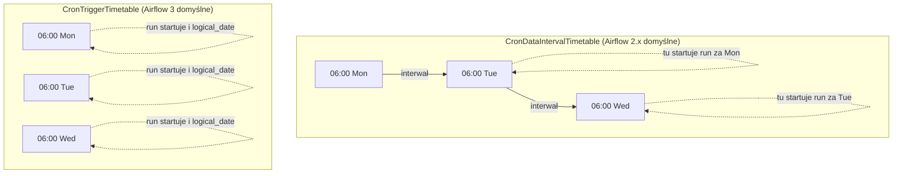

# Scheduling w Airflow — logical_date, data_interval, faktyczne uruchomienie

## Kluczowe pojęcia

| Pojęcie                    | Opis                                                                     |
| -------------------------- | ------------------------------------------------------------------------ |
| **logical_date**           | Logiczna data przypisana do danego runu DAG-a (dawniej `execution_date`) |
| **data_interval_start**    | Początek przedziału danych, za który odpowiada dany run                  |
| **data_interval_end**      | Koniec przedziału danych                                                 |
| **Faktyczne uruchomienie** | Realny moment, w którym scheduler startuje DAG                           |

---

## 1. CronDataIntervalTimetable (klasyczny Airflow 2.x)

```python
from airflow.timetables.interval import CronDataIntervalTimetable

# Jawnie:
DAG(dag_id="my_dag", timetable=CronDataIntervalTimetable("0 6 * * *", timezone="UTC"))

# Lub skrót (w Airflow 2.x identyczny efekt):
DAG(dag_id="my_dag", schedule="0 6 * * *")
```

### Zasada: DAG uruchamia się **na KOŃCU** interwału

```
Interwał 1               Interwał 2               Interwał 3
|________________________|________________________|________________________|
06:00 1 marca            06:00 2 marca            06:00 3 marca            06:00 4 marca
                         ^                        ^                        ^
                         Tu STARTUJE run           Tu STARTUJE run          Tu STARTUJE run
                         za interwał 1             za interwał 2            za interwał 3
```

### Przykład: cron `0 6 * * *` (codziennie o 06:00)

| Run | logical_date     | data_interval_start | data_interval_end | Faktyczne uruchomienie |
| --- | ---------------- | ------------------- | ----------------- | ---------------------- |
| 1   | 2024-03-01 06:00 | 2024-03-01 06:00    | 2024-03-02 06:00  | **2024-03-02 06:00**   |
| 2   | 2024-03-02 06:00 | 2024-03-02 06:00    | 2024-03-03 06:00  | **2024-03-03 06:00**   |
| 3   | 2024-03-03 06:00 | 2024-03-03 06:00    | 2024-03-04 06:00  | **2024-03-04 06:00**   |

> [!IMPORTANT]
> **logical_date = data_interval_start** (początek interwału)
> 
> DAG z `logical_date = 1 marca` tak naprawdę **uruchamia się 2 marca** — przetwarza dane **za okres 1-2 marca**.

### Dlaczego tak?

To model ETL: "poczekaj aż dane za dany okres będą kompletne, potem je przetwórz". DAG za poniedziałek uruchamia się we wtorek, bo dopiero wtedy dane z poniedziałku są w pełni dostępne.

---

## 2. CronTriggerTimetable (domyślne w Airflow 3)

```python
from airflow.timetables.trigger import CronTriggerTimetable

DAG(dag_id="my_dag", timetable=CronTriggerTimetable("0 6 * * *", timezone="UTC"))

# W Airflow 3: schedule="0 6 * * *" → automatycznie CronTriggerTimetable
```

### Zasada: DAG uruchamia się **dokładnie wtedy, kiedy mówi cron** — brak interwałów

```
06:00 1 marca            06:00 2 marca            06:00 3 marca
^                        ^                        ^
Run 1 startuje TU        Run 2 startuje TU        Run 3 startuje TU
```

### Przykład: cron `0 6 * * *`

| Run | logical_date     | data_interval_start | data_interval_end | Faktyczne uruchomienie |
| --- | ---------------- | ------------------- | ----------------- | ---------------------- |
| 1   | 2024-03-01 06:00 | 2024-03-01 06:00    | 2024-03-01 06:00  | **2024-03-01 06:00**   |
| 2   | 2024-03-02 06:00 | 2024-03-02 06:00    | 2024-03-02 06:00  | **2024-03-02 06:00**   |
| 3   | 2024-03-03 06:00 | 2024-03-03 06:00    | 2024-03-03 06:00  | **2024-03-03 06:00**   |

> [!IMPORTANT]
> **logical_date = data_interval_start = data_interval_end = faktyczne uruchomienie**
> 
> Wszystko jest tym samym momentem. `data_interval_start` i `data_interval_end` są **równe** — interwał ma zerową długość.

### Kiedy stosować?

Gdy DAG nie przetwarza danych za "okres" — np. trigger pipeline'u, wysyłka powiadomień, health check.

---

## 3. Timedelta (DeltaDataIntervalTimetable)

```python
from datetime import timedelta

DAG(dag_id="my_dag", schedule=timedelta(hours=2))
```

### Zasada: Działa jak DataInterval — uruchomienie na **końcu** interwału

```
start_date               +2h                      +4h                      +6h
|________________________|________________________|________________________|
10:00                    12:00                    14:00                    16:00
                         ^                        ^                        ^
                         Run 1 start              Run 2 start              Run 3 start
```

### Przykład: `timedelta(hours=2)`, start_date = 10:00

| Run | logical_date | data_interval_start | data_interval_end | Faktyczne uruchomienie |
| --- | ------------ | ------------------- | ----------------- | ---------------------- |
| 1   | 10:00        | 10:00               | 12:00             | **12:00**              |
| 2   | 12:00        | 12:00               | 14:00             | **14:00**              |
| 3   | 14:00        | 14:00               | 16:00             | **16:00**              |

> [!NOTE]
> Identyczna logika jak `CronDataIntervalTimetable` — logical_date = data_interval_start, uruchomienie na końcu interwału.

---

## 4. @once / None / Ręczne triggerowanie

```python
DAG(dag_id="my_dag", schedule="@once")
# lub
DAG(dag_id="my_dag", schedule=None)  # tylko ręczne triggery
```

| Pole                | Wartość         |
| ------------------- | --------------- |
| logical_date        | Moment triggera |
| data_interval_start | = logical_date  |
| data_interval_end   | = logical_date  |

Brak automatycznego schedulowania, interwał ma zerową długość.

---

## Porównanie wizualne



---

## Podsumowanie — ściąga

| Timetable                     | logical_date          | Faktyczne uruchomienie               | data_interval                     |
| ----------------------------- | --------------------- | ------------------------------------ | --------------------------------- |
| **CronDataIntervalTimetable** | Początek interwału    | Koniec interwału (o 1 okres później) | Ma sens — opisuje "za jaki okres" |
| **CronTriggerTimetable**      | = moment uruchomienia | = logical_date                       | Zerowy (start = end)              |
| **timedelta**                 | Początek interwału    | Koniec interwału                     | Ma sens                           |
| **@once / None**              | Moment triggera       | = logical_date                       | Zerowy                            |

> [!WARNING]
> **Pułapka migracji Airflow 2 → 3**: Jeśli Twój DAG używa `schedule="0 6 * * *"` i opiera logikę na `data_interval_start`/`data_interval_end` (np. do filtrowania danych za dany dzień), to po migracji do Airflow 3 **przestanie działać poprawnie**, bo interwał stanie się zerowy. Musisz jawnie użyć `CronDataIntervalTimetable`, żeby zachować stare zachowanie.

---

## Praktyczna rada — do którego Jinja template sięgać

| Chcesz...                           | DataInterval (klasyczny)                                                       | Trigger                                                               |
| ----------------------------------- | ------------------------------------------------------------------------------ | --------------------------------------------------------------------- |
| "Za jaki dzień przetwarzam dane?"   | `{{ data_interval_start \| ds }}`                                              | Musisz liczyć ręcznie: `{{ logical_date - macros.timedelta(days=1) }}` |
| "Kiedy DAG faktycznie wystartował?" | `{{ data_interval_end }}` (≈ czas startu)                                      | `{{ logical_date }}`                                                  |
| "Okno czasowe do query SQL"         | `WHERE date BETWEEN '{{ data_interval_start }}' AND '{{ data_interval_end }}'` | Nie ma okna — musisz zdefiniować je samodzielnie                      |
